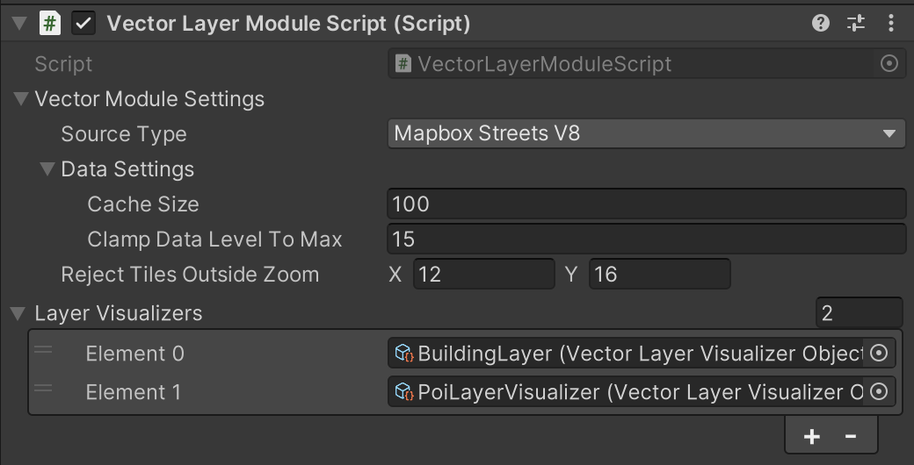
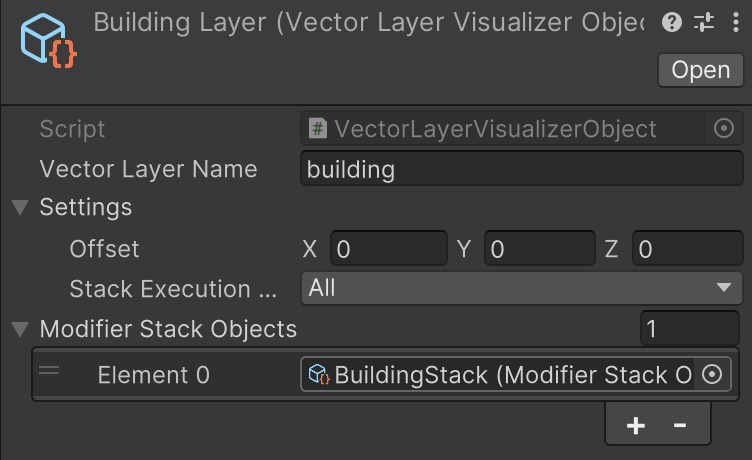
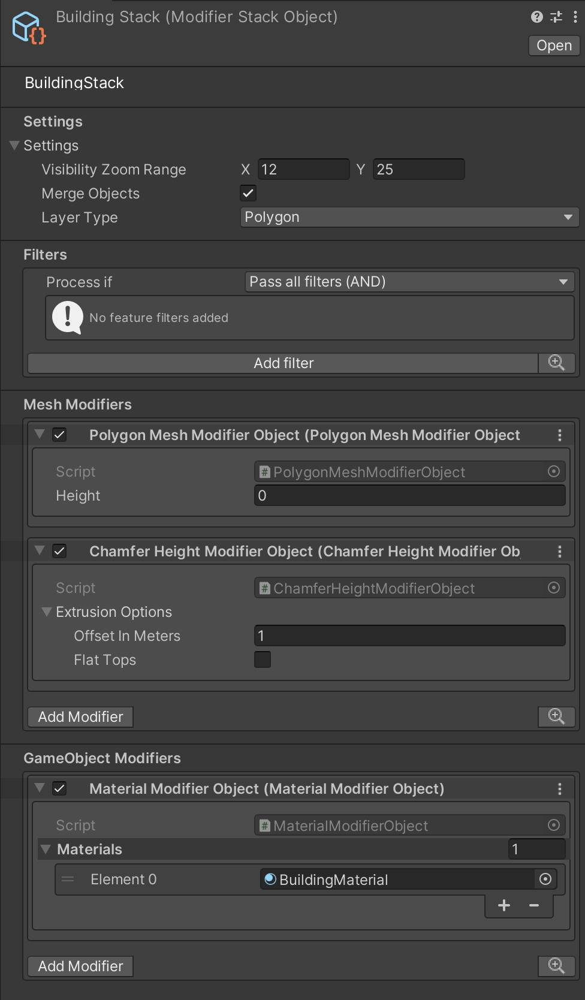

## Vector Module

The Vector module uses the [Mapbox Vector Tiles API](https://docs.mapbox.com/api/maps/vector-tiles/), which delivers map data in a vector-based format.  
Its main dataset is `Streets V8`, described in detail in the [Mapbox Streets v8 documentation](https://docs.mapbox.com/data/tilesets/reference/mapbox-streets-v8/).

This module handles downloading and decompressing vector data but does not render visuals by itself.  
Rendering is handled by “Layer Visualizers,” submodules that generate features such as 3D buildings from this data.  
Sample visualizers are included with the SDK package.

---

### Module Settings

The module has several key settings:

- **SourceType**  
  Defines the data source. Options are Mapbox Streets V8 or a custom tileset.  
  Choosing Streets V8 uses the main Mapbox dataset, while selecting Custom allows entering a custom tileset ID.  
  Tilesets created in Mapbox Studio are supported, but if the tileset is private (the default), the API key and style must belong to the same account.  
  Multiple tilesets can be added as comma-separated values. A button is also provided to add or remove Mapbox Streets from the list.

- **Cache Size**  
  Defines how many tile data objects can be kept in memory at once. When this limit is reached, the oldest entries are removed.

- **Clamp Data Level to Max**  
  Limits the maximum zoom level for the data.  
 For instance, ‘building’ layer goes from zoom level 13 to zoom level 16 but if this setting is set to 15, map area will be filled with zoom level 15 buildings at maximum detail. This is useful because there’s a small differences between zoom level 15 and 16 buildings yet former will require four times less data to fill the area.

- **Reject Tiles Outside Zoom**  
  Discards tile requests outside the specified range.  
  Unlike clamping, which still loads the tile but adjusts the level, this setting blocks the request entirely. Useful for ignoring low zoom levels.

Below these settings is a list of Layer Visualizers. You can add or remove visualizer assets here.  
Visualizer assets can be created from the context menu: `Create / Mapbox / Modifiers / Layer Visualizer`.

---

### Layer Visualizer

Each Layer Visualizer defines how a specific vector layer is processed and visualized.

- **Vector Layer Name**  
  Specifies the layer to process, such as `building` or `poi_label`.  
  This should match the names in [Mapbox Streets v8](https://docs.mapbox.com/data/tilesets/reference/mapbox-streets-v8/#layer-reference) or in your custom tileset.

- **Offset**  
  Applies an offset to the visualized objects. For example, road meshes can be raised slightly to avoid intersecting terrain.  
  The offset is applied to a root object (the parent of generated visuals) and not to the individual visuals.

- **Stack Execution Mode**  
  Controls how modifier stacks (style groups) are executed.  
  A visualizer can have multiple stacks. For example, one to generate 3D building meshes and another to spawn prefabs on building corners.  
  If both should run, set this to “All.”  
  In contrast, “First Hit” stops after the first matching stack. For example, if one stack spawns prefabs for commercial buildings, the second (mesh generation) stack won’t run for those.

As with the Vector Module, each visualizer ends with a list of Modifier Stacks.

---

### Modifier Stack

A Modifier Stack defines how feature data is transformed into rendered objects—effectively acting as a visual “style.”

It has several configuration options:

- **Visibility Zoom Range**  
  Hides or shows visuals depending on the zoom level.  
  This lets you download and process data while toggling visibility at certain distances.

- **Merge Objects**  
  Combines generated meshes into a single object for better performance.  
  Instead of hundreds of building meshes, a merged object produces one combined mesh per tile.

- **Layer Type**  
  Determines how features are positioned and scaled.

Below these, three main sections define the behavior of the stack:

- **Filters**  
  Decide which features the stack should run on.  
  For example, you might skip buildings above a certain height or select only specific point types.  
  A dropdown lets you choose whether a feature must pass all filters, any of them, or none.

- **Mesh Modifiers**  
  Convert raw feature data into mesh geometry.  
  Examples include:
  - `Polygon Mesh Modifier` — triangulates building outlines into polygons.  
  - `Height Modifier` — extrudes these polygons vertically to create volumetric meshes.

- **Game Object Modifiers**  
  Run after mesh creation and operate on the generated GameObjects.  
  They do not produce new mesh data but modify existing GameObject, such as applying materials or adding interaction scripts.

After the game object modifiers finish, the visual generation process is complete.
