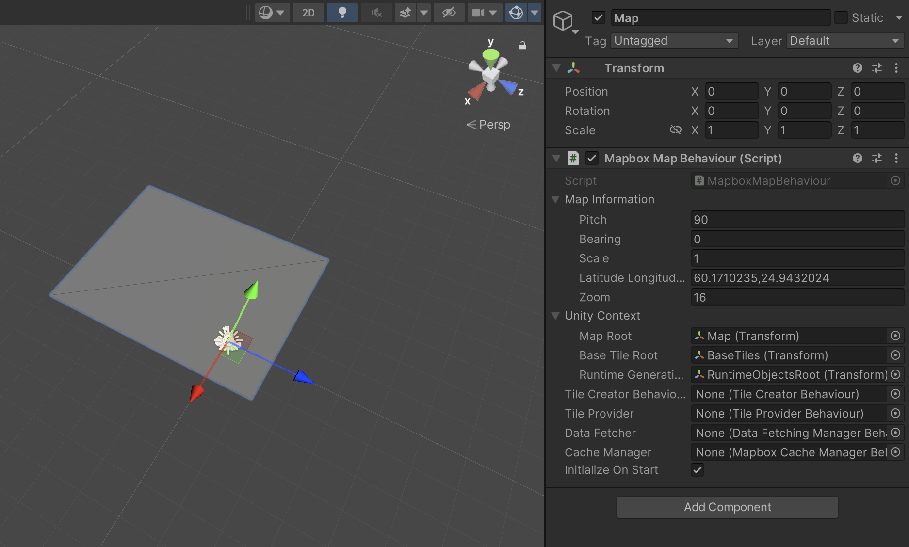
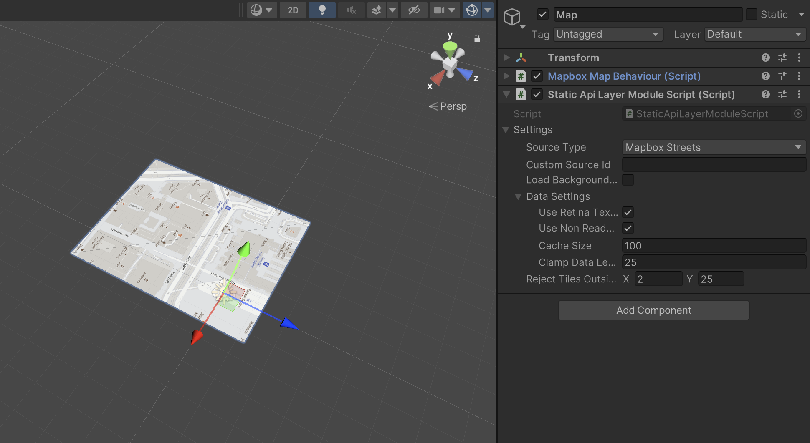
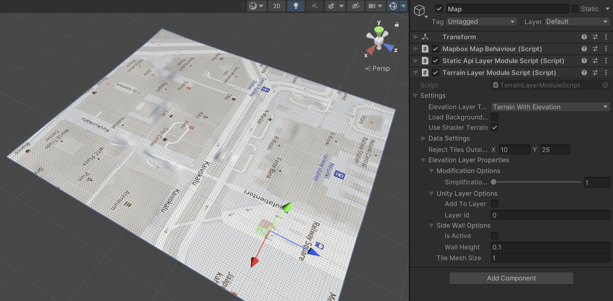
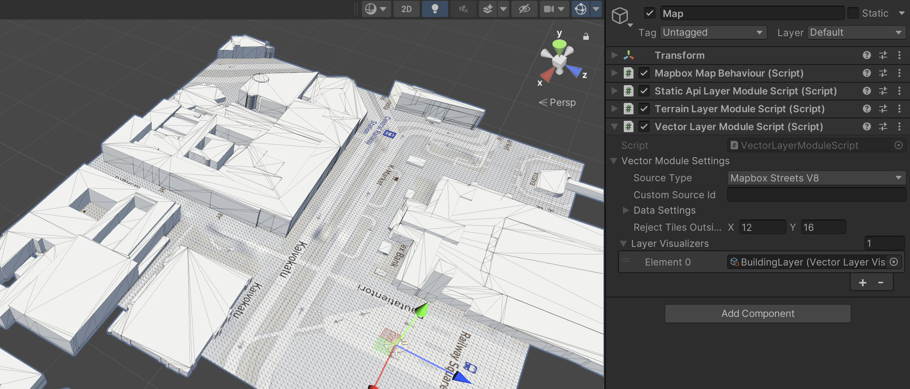

## Layer module basics

Layer modules are core systems that correspond to Mapbox API endpoints such as the Static API, Terrain API, and Vector API.  
They are orchestrated by the map object, which requests, processes, and visualizes data from these modules to build and decorate the map.  
Four main components are important in this context: (1) the base map system, (2) the Static API layer module, (3) the Terrain layer module, and (4) the Vector layer module.

### Creating the base map
To use modules and generate a visual map, we first need a base map system.  
Start by creating a GameObject with the `MapboxMapBehaviour` script attached. The script usually includes default settings, but if it doesn’t (especially in earlier SDK versions), you can set the following basic values manually:

- Pitch: 90  
- Scale: 1  
- Zoom: 16  
- Latitude/Longitude: any location you prefer  

Running the application now with only this base map script will display empty tiles of various sizes created in the scene.

Once the map exists, you can add modules to decorate it. The base map script automatically searches for any layer module scripts attached to the same GameObject and includes them in its update cycle.

### Static API Layer Module
The Static API layer module uses the [Mapbox Static Images API](https://docs.mapbox.com/api/maps/static-images/), which serves pre-rendered images of requested regions.  
This module downloads and applies the appropriate images to the map tiles. By default, these textures are rendered using a custom shader and material setup.

If the tile material or shader is changed (for example, through a custom tile creator script), the Static API layer module may not find the correct texture fields, and images may not display as expected.

### Terrain Layer Module
The Terrain layer module uses the [Mapbox Terrain-RGB API](https://docs.mapbox.com/data/tilesets/reference/mapbox-terrain-rgb-v1/), which provides global elevation data encoded as color values in PNG files.  
The module downloads elevation tiles for the current map view and either passes them to the material for GPU-side elevation generation or processes them on the CPU to build a 3D mesh. Each method has its advantages and tradeoffs.

Currently, the Terrain layer module supports only the `rgb v1` API, with `dem v1` support planned for the future.

As with the Static API module, the Terrain module (in shader-based elevation mode) depends on a specific terrain material and shader setup.

### Vector Module
The Vector module uses the [Mapbox Vector Tiles API](https://docs.mapbox.com/api/maps/vector-tiles/), which delivers vector-based map data.  
The main dataset it targets is `Streets V8`, and you can find more details about its structure in the [Mapbox Streets v8 documentation](https://docs.mapbox.com/data/tilesets/reference/mapbox-streets-v8/).

This module downloads and decompresses vector data but does not render visuals on its own.  
Visualization happens through submodules called “Layer Visualizers,” which generate actual map features such as 3D buildings (extruded polygons).  
You can find sample visualizers included with the SDK package.

